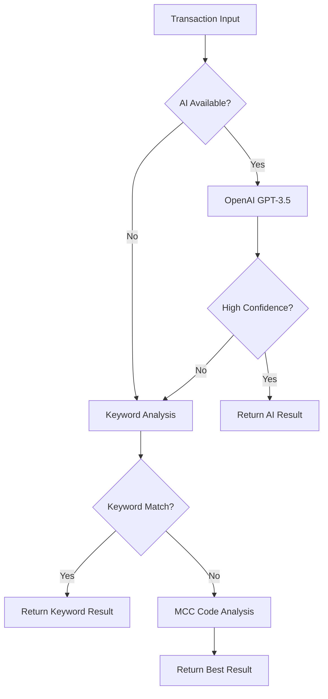

# AI Categorization System

A comprehensive AI-powered expense categorization system with multiple fallback strategies and robust error handling.

## ✨ **Features**

### 🤖 **Multi-Strategy Categorization**
- **AI-Powered**: OpenAI GPT-3.5-turbo for intelligent categorization
- **Keyword Matching**: Rule-based categorization using merchant keywords
- **MCC Code Mapping**: Merchant Category Code based classification
- **Smart Fallbacks**: Automatic fallback when primary methods fail

### 🛡️ **Error Handling & Resilience**
- **Rate Limit Handling**: Automatic retry with exponential backoff
- **Network Error Recovery**: Retry logic for transient failures
- **Graceful Degradation**: Falls back to rule-based methods when AI fails
- **Comprehensive Logging**: Detailed error tracking and debugging

### 📊 **Batch Processing**
- **Progress Tracking**: Real-time progress updates for batch operations
- **Concurrent Processing**: Optimized for processing multiple transactions
- **Summary Analytics**: Detailed reports on categorization results
- **Memory Efficient**: Handles large transaction datasets

## 🏗️ **Architecture**

### **Core Components**

```
src/lib/ai/
├── categorization.ts          # Main AI categorization service
├── hooks/
│   └── useAICategorization.ts # React hooks for UI integration
└── components/
    └── CategorizationPanel.tsx # UI component for categorization
```

### **API Integration**

```
src/app/api/
└── categorize/
    └── route.ts              # API endpoint for categorization
```

### **Categorization Flow**



## 📋 **Categories**

The system supports 11 standardized business expense categories:

| Category | Keywords | Description |
|----------|----------|-------------|
| **Office Supplies** | office, supplies, staples, paper | Office supplies and stationery |
| **Software & SaaS** | software, saas, subscription, aws | Software licenses and subscriptions |
| **Meals & Entertainment** | restaurant, food, coffee, starbucks | Business meals and entertainment |
| **Travel & Transportation** | hotel, flight, uber, taxi | Business travel expenses |
| **Marketing & Advertising** | marketing, ads, promotion | Marketing and advertising costs |
| **Professional Services** | legal, accounting, consulting | Professional service fees |
| **Equipment & Hardware** | computer, laptop, monitor | Computer equipment purchases |
| **Utilities & Internet** | internet, phone, utilities | Communication and utility bills |
| **Insurance** | insurance, premium, coverage | Business insurance premiums |
| **Training & Education** | training, course, conference | Employee development costs |
| **Other** | - | Miscellaneous business expenses |

## 🚀 **Usage**

### **Basic Categorization**

```typescript
import { aiCategorization } from '@/lib/ai/categorization';

// Single transaction
const result = await aiCategorization.categorizeTransaction(transaction);
console.log(`Category: ${result.category} (${result.confidence})`);

// Batch processing
const results = await aiCategorization.categorizeTransactionsBatch(
  transactions,
  (completed, total) => console.log(`Progress: ${completed}/${total}`)
);
```

### **React Integration**

```typescript
import { useTransactionCategorization } from '@/lib/hooks/useAICategorization';

function TransactionCard({ transaction }) {
  const categorization = useTransactionCategorization();
  
  const handleCategorize = async () => {
    const result = await categorization.mutateAsync(transaction);
    console.log('Categorized as:', result.category);
  };

  return (
    <button onClick={handleCategorize} disabled={categorization.isPending}>
      {categorization.isPending ? 'Categorizing...' : 'Categorize'}
    </button>
  );
}
```

### **API Endpoint Usage**

```bash
# Single transaction
curl -X POST /api/categorize \
  -H "Content-Type: application/json" \
  -d '{"transaction": {...}}'

# Batch processing
curl -X POST /api/categorize \
  -H "Content-Type: application/json" \
  -d '{"transactions": [...]}'

# Service status
curl -X GET /api/categorize
```

## ⚙️ **Configuration**

### **Environment Variables**

```env
# Required for AI categorization
OPENAI_API_KEY=sk-proj-...

# Optional configuration
OPENAI_MODEL=gpt-3.5-turbo
OPENAI_MAX_TOKENS=200
OPENAI_TEMPERATURE=0.3
```

### **Service Settings**

```typescript
const aiCategorization = new AICategorizationService({
  maxRetries: 3,           // Maximum retry attempts
  baseDelay: 1000,         // Base delay for exponential backoff (ms)
  timeout: 30000,          // Request timeout (ms)
});
```

## 📊 **Response Format**

### **Categorization Result**

```typescript
interface CategorizationResult {
  category: ExpenseCategory;     // The assigned category
  confidence: number;            // Confidence score (0-1)
  reasoning: string;             // Explanation of the categorization
  method: 'ai' | 'keyword' | 'mcc' | 'fallback';  // Method used
}
```

### **Example Response**

```json
{
  "category": "Software & SaaS",
  "confidence": 0.95,
  "reasoning": "AWS is a cloud computing platform, clearly categorized as Software & SaaS",
  "method": "ai"
}
```

## 🔧 **Error Handling**

### **Error Types**

- **`RATE_LIMIT`**: OpenAI rate limit exceeded
- **`OPENAI_ERROR`**: OpenAI API server error
- **`NETWORK_ERROR`**: Network connectivity issues
- **`PARSING_ERROR`**: Invalid AI response format
- **`UNKNOWN_ERROR`**: Unexpected errors

### **Fallback Strategy**

1. **Primary**: OpenAI GPT-3.5 with structured prompts
2. **Secondary**: Keyword-based matching with merchant names
3. **Tertiary**: MCC code mapping for merchant categories
4. **Final**: Default to "Other" category with low confidence

### **Retry Logic**

- **Rate Limits**: Exponential backoff with respect for `Retry-After` headers
- **Server Errors**: 3 retry attempts with exponential backoff
- **Network Errors**: Automatic retry for transient connection issues
- **Client Errors**: No retry for 4xx errors (except 429)

## 📈 **Performance & Monitoring**

### **Metrics Tracked**

- **Success Rate**: Percentage of successful categorizations
- **Method Distribution**: Usage of AI vs fallback methods
- **Confidence Scores**: Average confidence across categorizations
- **Processing Time**: Latency for single and batch operations
- **Error Rates**: Frequency and types of errors encountered

### **Optimization Features**

- **Token Caching**: Reuse OpenAI authentication tokens
- **Rate Limit Awareness**: Respect API limits to avoid blocks
- **Batch Optimization**: Process multiple transactions efficiently
- **Memory Management**: Handle large datasets without memory leaks

## 🧪 **Testing**

### **Test Script**

Run the comprehensive test suite:

```bash
npx tsx src/scripts/test-categorization.ts
```

### **Test Coverage**

- ✅ Single transaction categorization
- ✅ Batch processing with progress tracking
- ✅ Error handling and fallback mechanisms
- ✅ Rate limiting and retry logic
- ✅ Confidence score validation
- ✅ Category mapping accuracy

### **Sample Output**

```
🤖 Testing AI Categorization System

📊 Service Status:
  - Initialized: ✅
  - Has API Key: ✅
  - Rate Limited: ✅

🔍 Testing Single Transaction Categorization:

Transaction 1: Amazon Web Services - $1250
  ✅ Category: Software & SaaS
  📊 Confidence: 95%
  🔧 Method: ai
  💭 Reasoning: AWS is a cloud computing platform

📦 Testing Batch Categorization:

Processing 5 transactions...
  Progress: 5/5 (100%)

📈 Batch Results Summary:
  Total Processed: 5

  Methods Used:
    ai: 3 transactions
    keyword: 1 transactions
    mcc: 1 transactions

  Categories Assigned:
    Software & SaaS: 2 transactions
    Office Supplies: 1 transactions
    Meals & Entertainment: 1 transactions
    Equipment & Hardware: 1 transactions

✅ Categorization testing complete!
```

## 🔒 **Security**

### **API Key Protection**

- Environment variable storage only
- Never logged or exposed in responses
- Automatic masking in error messages
- Secure transmission over HTTPS

### **Data Privacy**

- Transaction data sent to OpenAI for categorization
- No persistent storage of transaction data
- Minimal data exposure (merchant name, amount, category)
- Option to disable AI and use local methods only

## 🚀 **Future Enhancements**

### **Planned Features**

- **Learning System**: Improve accuracy based on manual corrections
- **Custom Categories**: User-defined expense categories
- **Confidence Tuning**: Adjustable confidence thresholds
- **Analytics Dashboard**: Categorization insights and trends
- **Webhook Integration**: Real-time categorization notifications
- **Multi-language Support**: Categorization in multiple languages

### **Performance Improvements**

- **Caching Layer**: Cache categorization results for similar transactions
- **Parallel Processing**: Concurrent API calls for batch operations
- **Model Optimization**: Fine-tuned models for expense categorization
- **Edge Computing**: Local categorization for common patterns

## 📞 **Support**

For issues or questions about the AI categorization system:

1. Check the service status: `GET /api/categorize`
2. Review error logs for specific error codes
3. Test with the included test script
4. Verify environment variables are set correctly
5. Check OpenAI API key permissions and quotas

The system is designed to gracefully degrade and provide useful categorizations even when AI services are unavailable.
